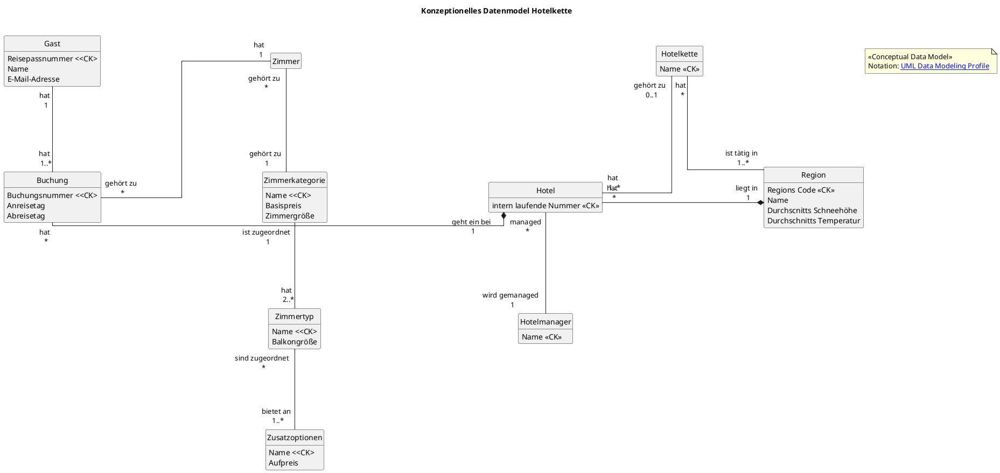

### Aufgabenstellung: Konzeptionelles Datenbankmodell für Hotelketten

Entwickeln Sie ein konzeptionelles Datenbankmodell für folgende Aufgabenstellung.

Die Hotelkette "SleepWell" ist in verschiedenen Urlaubsregionen tätig. In der Region "Alpen-Nord" (Regionscode "ALN", durchschnittliche Schneehöhe 150cm) betreibt die Kette noch kein Hotel, wohingegen in der Region "Mallorca-Ost" (Regionscode "PMI", Durchschnittstemperatur 22°C) bereits drei Hotels betrieben werden. Die Hotels, die in ein und derselben Region liegen, werden durch eine interne laufende Nummer voneinander unterschieden. Das Hotel in "Mallorca-Ost" mit der laufenden Nummer 2 befindet sich an der Strandpromenade 5 (PLZ 07000); es wird von einem Hotelmanager geleitet, dessen Name erfasst werden muss.

---

Die Hotelkette vermietet Zimmer grundsätzlich nur nach vorheriger Buchung. Bei einer Buchung, die stets bei genau einem spezifischen Hotel eingeht, kann der Gast, über den Name und E-Mail-Adresse gespeichert werden und der durch seine Reisepass-Nummer identifiziert wird, eine Zimmerkategorie auswählen. Die Zimmerkategorie "Premium" hat einen Basispreis von 120 Euro/Nacht und eine Mindestgröße von 40qm. 

Sie umfasst unter anderem die Zimmertypen "Junior Suite" (Balkongröße 5qm) und "Penthouse Suite" (Balkongröße 20qm). Zu jedem Zimmertyp werden die Zusatzoptionen gespeichert, die für diesen Zimmertyp prinzipiell möglich sind. Für eine "Junior Suite" ist beispielsweise die Zusatzoption "Zustellbett" für einen Aufpreis von 30 Euro/Nacht buchbar. Für die "Penthouse Suite" beträgt der Aufpreis für die Zusatzoption "Zustellbett" 50 Euro/Nacht. Jedes Hotel vergibt für die bei ihm eingegangenen Buchungen jeweils eine laufende Buchungsnummer. Für jede dieser Buchungen wird der gewünschte Anreise- und Abreisetag festgehalten.

---

Eine Buchung kann zu einem Aufenthalt führen, der beim Check-in des Gastes registriert wird. Ein Aufenthalt ist durch die zugehörige Buchung eindeutig gekennzeichnet. Zum Aufenthalt wird der gezahlte Anzahlungsbetrag beim Check-in und später der Gesamtbetrag beim Check-out festgehalten. Außerdem wird beim Check-in festgelegt, welches konkrete Zimmer vom Gast bewohnt wird. Da es vorkommt, dass Buchungen storniert werden oder Gäste nicht erscheinen (No-Show), sollen lediglich für die tatsächlich angetretenen Aufenthalte die Aufenthaltsdaten gespeichert werden.

Die einzelnen Zimmer der Hotelkette werden durch eine weltweit eindeutige Raumnummer (z.B. UUID oder Barcode am Türschloss) voneinander unterschieden. Zu jedem Zimmer muss ersichtlich sein, auf welcher Etage es liegt, ob es gerade gereinigt ist (Status), zu welchem Zimmertyp es gehört und in welchem Hotel es sich befindet. Außerdem wird festgehalten, über welche konkreten Zusatzoptionen das Zimmer fest verfügt (z.B. ob in diesem spezifischen Zimmer tatsächlich ein Safe oder eine Minibar fest verbaut ist, sofern der Zimmertyp dies prinzipiell erlaubt).

**Weiterhin ist zu beachten:**

* Ein gerade erst geplantes Hotel besitzt noch keine Zimmer und hat noch keine Buchungen entgegengenommen.
* Ein Gast wird erst dann in der Datenbank gespeichert, wenn er seine erste Buchung tätigt.
* Es ist möglich, dass eine Zimmerkategorie, die stets mindestens zwei Zimmertypen umfasst, noch bei keiner Buchung gewünscht wurde.
* Ein Zimmertyp wird in genau eine Zimmerkategorie eingeordnet. Zu einem neu definierten Zimmertyp muss die Hotelkette noch kein einziges physisches Zimmer besitzen.
* Einen Zimmertyp ohne mögliche Zusatzoptionen gibt es nicht. Jedoch kann ein konkretes Zimmer keine der prinzipiell möglichen Zusatzoptionen aufweisen (z.B. ein Standardzimmer ohne Extras). Eine mögliche Zusatzoption (z.B. "Whirlpool") kann so exklusiv sein, dass sie momentan in keinem der Zimmer der Hotelkette tatsächlich verbaut ist.
* Ein gerade erst gebautes Zimmer wurde noch nie belegt. Es wird im Laufe der Zeit aber vielen Aufenthalten zugeordnet.
* Ein Zimmer gehört zu jedem Zeitpunkt zu genau einem Hotel.

<!-- 
class "Stadt" as stadt {
    Stadtcode <<CK>>
    Name
    Einwohner Anzahl
}

stadt "liegt in \n 1"*--"vorhanden \n *" vermietstation
kunde "betrifft \n 1"--"taetigt \n 1..*" reservierung
vermietstation "vorgenommen \n bei 1"*-"verwaltet \n *" reservierung
reservierung "entsteht durch \n 1"*-"fuehrt zu \n 0..1" mietvertrag 
-->

