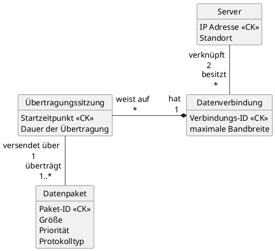
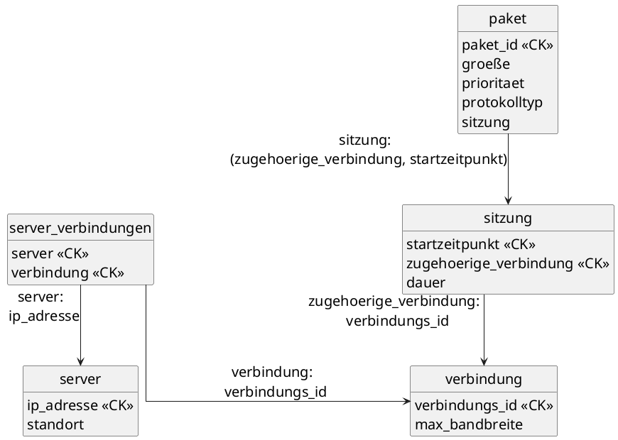

### Domänenbeschreibung: IT-Netzwerk-Überwachung

Ein IT-Dienstleister verwaltet `Server` und die definierten Datenverbindungen zwischen ihnen. Jeder Server, der durch eine eindeutige IP-Adresse und seinen Standort (z. B. "Rechenzentrum A") gekennzeichnet ist, kann im System registriert sein, selbst wenn er aktuell isoliert ist und keine aktiven Verbindungen besitzt.

Jede `Datenverbindung` (identifiziert durch eine Verbindungs-ID wie CONN-505; und mit einer maximalen Bandbreite) verknüpft genau zwei Server: einen Quell-Server und einen Ziel-Server. Ein Server kann Ausgangs- und/oder Endpunkt für beliebig viele Verbindungen sein. Auf Basis dieser physischen oder logischen Verbindungen werden `Übertragungssitzungen` protokolliert. Eine Sitzung entspricht stets genau einer definierten Datenverbindung und wird **zusätzlich** durch einen Zeitstempel (Startzeitpunkt) identifiziert. Eigenschaft einer Sitzung sind die Dauer der Übertragung. Eine Datenverbindung muss noch keine Sitzungen aufweisen. Allerdings muss jede Sitzung, die im Protokoll als erfolgreich gespeichert wird, eines oder mehrere Datenpakete übertragen haben, da leere Sitzungen nicht archiviert werden. Ein `Datenpaket`, das durch eine Paket-ID identifiziert wird und Attribute wie Größe (in KB) und Priorität trägt, kann dabei einem spezifischen Protokolltyp zugeordnet werden.

----
#### Konzeptionelles Diagramm




----
#### Logisches Diagramm




----
#### Physisches Diagramm

```sql
CREATE TABLE server (
    ip_adresse INET PRIMARY KEY,
    standort VARCHAR(128)
)

CREATE TABLE verbindung (
    verbindungs_id VARCHAR(16) PRIMARY KEY,
    max_bandbreite FLOAT,
    quell_server_ip INET NOT NULL,
    ziel_server_ip INET NOT NULL,
    CONSTRAINT chk_diff_servers CHECK (quell_server_ip <> ziel_server_ip)
)

CREATE TABLE sitzung (
    startzeitpunkt TIMESTAMP
    zugehoerige_verbindung VARCHAR(16),
    dauer INTERVAL,
    PRIMARY KEY(startzeitpunkt, zugehoerige_verbindung),
    FOREIGN KEY(zugehoerige_verbindung) 
        REFERENCES verbindung(verbindungs_id)
        ON DELETE NO ACTION
)

CREATE TABLE paket (
    paket_id VARCHAR(64) PRIMARY KEY,
    groeße FLOAT CHECK (groeße > 0),
    prioritaet INTEGER,
    protokolltyp VARCHAR(64),
    sitzung_startzeitpunkt TIMESTAMP,
    sitzung_verbindung VARCHAR(16),
    FOREIGN KEY(sitzung_startzeitpunkt, sitzung_verbindung) 
        REFERENCES sitzung(startzeitpunkt, zugehoerige_verbindung)
        ON DELETE CASCADE
)

CREATE TABLE server_verbindungen (
    server INET,
    verbindung VARCHAR(16),
    PRIMARY KEY(server, verbindung),
    FOREIGN KEY(server) 
        REFERENCES server(ip_adresse),
    FOREIGN KEY(verbindung) 
        REFERENCES verbindung(verbindungs_id)
)
```