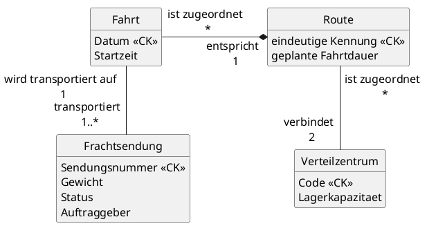

**Domänenbeschreibung: Logistik-Verbundsystem**

Ein Logistikunternehmen verwaltet Standard-`Transportrouten` und die zugehörigen `Verteilzentren`. Jedes Verteilzentrum (VZ), das durch einen eindeutigen Code (z. B. HAM) und seine Lagerkapazität gekennzeichnet ist, kann bereits im System erfasst sein, auch wenn es noch keiner Route zugeordnet ist.

Jede Route (identifiziert durch eine eindeutige Kennung wie R-101; und mit einer geplanten Fahrtdauer) verbindet genau zwei Verteilzentren: ein Start-VZ und ein Ziel-VZ. Ein VZ kann Start- und/oder Zielpunkt für beliebig viele Routen sein. Auf Basis dieser Routen werden `Fahrten` durchgeführt. Eine Fahrt entspricht stets genau einer Route und wird **zusätzlich** durch das Datum identifiziert. Attribute einer Fahrt sind die tatsächliche Startzeit. Eine Route muss noch keine Fahrt aufweisen. Allerdings muss jede Fahrt, die im System als durchgeführt gespeichert wird, eine oder mehrere `Frachtsendungen` transportieren, da Leerfahrten ignoriert werden. Eine Sendung, die durch eine globale Sendungsnummer identifiziert wird und Attribute wie Gewicht und Status trägt, kann dabei einem bekannten Auftraggeber zugeordnet werden.

---
**Konzeptuelles Modell**

